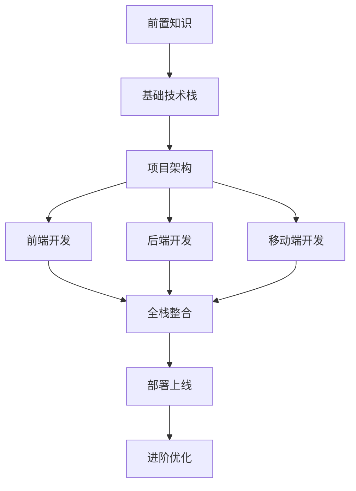

# 🎓 全栈AI聊天应用学习路线 

## 📋 学习目标

通过这个学习路线，你将掌握：
- 现代化全栈开发技能
- AI 应用开发最佳实践
- Monorepo 项目架构
- 实时通信系统构建
- 跨平台应用开发

---

## 🗺️ 学习路径概览



---

## 📚 阶段一：前置知识准备 (1-2周)

### 必备基础
- [ ] **JavaScript ES6+**: 解构、箭头函数、Promise、async/await
- [ ] **TypeScript 基础**: 类型系统、泛型、装饰器
- [ ] **Node.js 基础**: 模块系统、包管理、异步编程
- [ ] **数据库基础**: SQL 语法、关系型数据库概念
- [ ] **版本控制**: Git 基本操作、分支管理

### 推荐学习资源
- [TypeScript 官方教程](https://www.typescriptlang.org/docs/)
- [JavaScript MDN 文档](https://developer.mozilla.org/zh-CN/docs/Web/JavaScript)
- [Node.js 官方指南](https://nodejs.org/en/learn)

### 实践项目
- 构建一个简单的 Node.js CLI 工具
- 使用 TypeScript 重构现有的 JavaScript 项目

---

## 🏗️ 阶段二：基础技术栈学习 (2-3周)

### 前端技术栈
- [ ] **React 18+**: Hooks、Context、并发特性
- [ ] **Next.js 15**: App Router、SSR/SSG、API Routes
- [ ] **Tailwind CSS**: 原子化CSS、响应式设计
- [ ] **状态管理**: Zustand 或 React Query

### 后端技术栈
- [ ] **NestJS**: 依赖注入、模块系统、守卫和拦截器
- [ ] **Prisma**: Schema 设计、查询构建、迁移管理
- [ ] **GraphQL**: Schema 定义、Resolver、查询优化
- [ ] **WebSocket**: 实时通信原理、Socket.io

### 数据库
- [ ] **PostgreSQL**: 高级查询、索引优化、事务管理
- [ ] **Redis**: 缓存策略、会话存储、发布订阅

### 学习计划
```
第1周: React + Next.js 基础
第2周: NestJS + Prisma 基础  
第3周: GraphQL + WebSocket
```

---

## 🏛️ 阶段三：项目架构设计 (1周)

### Monorepo 架构
- [ ] **pnpm workspace**: 包管理和依赖共享
- [ ] **项目结构设计**: apps、packages 目录规划
- [ ] **共享包创建**: types、shared、ui、config
- [ ] **构建系统**: Turborepo 或 Nx

### 架构模式
- [ ] **微服务架构**: 服务拆分、通信机制
- [ ] **事件驱动**: 发布订阅、消息队列
- [ ] **DDD 设计**: 领域建模、聚合根
- [ ] **CQRS 模式**: 命令查询分离

### 实践练习
- 设计聊天应用的系统架构图
- 创建 Monorepo 项目模板
- 实现共享类型定义

---

## 💻 阶段四：前端开发 (3-4周)

### 第1周：基础UI构建
- [ ] **项目初始化**: Next.js 项目搭建
- [ ] **UI 组件库**: 基于 Radix UI 构建
- [ ] **主题系统**: 深色/浅色模式切换
- [ ] **响应式布局**: 移动端适配

### 第2周：聊天功能开发
- [ ] **聊天界面**: 消息列表、输入框、工具栏
- [ ] **实时消息**: WebSocket 连接和状态管理
- [ ] **消息类型**: 文本、图片、文件、语音
- [ ] **流式响应**: 实时显示 AI 回复

### 第3周：高级功能
- [ ] **线程管理**: 多会话切换、历史记录
- [ ] **文件上传**: 拖拽上传、预览、压缩
- [ ] **用户系统**: 登录注册、个人资料
- [ ] **搜索功能**: 全文搜索、筛选排序

### 第4周：优化和完善
- [ ] **性能优化**: 代码分割、图片优化、缓存策略
- [ ] **错误处理**: 错误边界、重试机制
- [ ] **用户体验**: 加载状态、骨架屏、动画效果
- [ ] **测试编写**: 单元测试、集成测试

### 关键知识点
```javascript
// 实时消息处理
const useWebSocket = (url) => {
  const [socket, setSocket] = useState(null);
  const [messages, setMessages] = useState([]);
  
  useEffect(() => {
    const ws = new WebSocket(url);
    ws.onmessage = (event) => {
      const message = JSON.parse(event.data);
      setMessages(prev => [...prev, message]);
    };
    setSocket(ws);
    return () => ws.close();
  }, [url]);
  
  return { socket, messages };
};

// 流式响应处理
const useStreamingResponse = () => {
  const [content, setContent] = useState('');
  const [isStreaming, setIsStreaming] = useState(false);
  
  const startStream = async (prompt) => {
    setIsStreaming(true);
    const response = await fetch('/api/chat', {
      method: 'POST',
      body: JSON.stringify({ prompt }),
      headers: { 'Content-Type': 'application/json' }
    });
    
    const reader = response.body.getReader();
    while (true) {
      const { done, value } = await reader.read();
      if (done) break;
      
      const chunk = new TextDecoder().decode(value);
      setContent(prev => prev + chunk);
    }
    setIsStreaming(false);
  };
  
  return { content, isStreaming, startStream };
};
```

---

## 🚀 阶段五：后端开发 (3-4周)

### 第1周：项目基础
- [ ] **NestJS 项目搭建**: 模块、控制器、服务
- [ ] **数据库设计**: Prisma Schema、关系设计
- [ ] **环境配置**: 配置管理、环境变量验证
- [ ] **基础中间件**: 日志、CORS、安全头

### 第2周：认证授权
- [ ] **用户模型**: 注册、登录、密码加密
- [ ] **JWT 认证**: 令牌生成、验证、刷新
- [ ] **权限控制**: RBAC、资源权限
- [ ] **第三方登录**: OAuth2、社交登录

### 第3周：核心业务
- [ ] **聊天功能**: 消息 CRUD、线程管理
- [ ] **AI 集成**: OpenAI API、流式响应
- [ ] **文件服务**: 上传、存储、CDN
- [ ] **WebSocket**: 实时通信、房间管理

### 第4周：高级特性
- [ ] **GraphQL**: Schema 设计、Resolver 优化
- [ ] **缓存策略**: Redis 缓存、查询优化
- [ ] **任务队列**: 异步任务、定时任务
- [ ] **监控日志**: 性能监控、错误追踪

### 核心代码示例
```typescript
// 聊天服务
@Injectable()
export class ChatService {
  constructor(
    private readonly prisma: PrismaService,
    private readonly aiService: AIService,
    private readonly websocketGateway: WebSocketGateway,
  ) {}

  async sendMessage(userId: string, threadId: string, content: string) {
    // 保存用户消息
    const userMessage = await this.prisma.message.create({
      data: {
        content,
        userId,
        threadId,
        type: 'USER',
      },
    });

    // 获取 AI 回复
    const aiResponse = await this.aiService.generateResponse(content);
    
    // 保存 AI 消息
    const aiMessage = await this.prisma.message.create({
      data: {
        content: aiResponse,
        threadId,
        type: 'ASSISTANT',
      },
    });

    // 实时推送
    this.websocketGateway.sendMessageToRoom(threadId, aiMessage);
    
    return aiMessage;
  }
}

// WebSocket 网关
@WebSocketGateway({ cors: true })
export class WebSocketGateway {
  @WebSocketServer()
  server: Server;

  @SubscribeMessage('join-thread')
  handleJoinThread(
    @ConnectedSocket() client: Socket,
    @MessageBody() data: { threadId: string },
  ) {
    client.join(data.threadId);
  }

  sendMessageToRoom(threadId: string, message: any) {
    this.server.to(threadId).emit('new-message', message);
  }
}
```

---

## 📱 阶段六：移动端开发 (2-3周)

### 第1周：React Native 基础
- [ ] **环境搭建**: Expo CLI、开发工具配置
- [ ] **基础组件**: 导航、布局、样式
- [ ] **状态管理**: Context API、Redux Toolkit
- [ ] **网络请求**: Fetch API、错误处理

### 第2周：核心功能
- [ ] **聊天界面**: 消息列表、输入组件
- [ ] **实时通信**: WebSocket 集成
- [ ] **文件处理**: 图片选择、相机集成
- [ ] **推送通知**: 本地通知、远程推送

### 第3周：原生功能
- [ ] **设备API**: 相机、麦克风、存储
- [ ] **离线支持**: SQLite、数据同步
- [ ] **性能优化**: 列表虚拟化、图片缓存
- [ ] **打包发布**: iOS/Android 构建

### 关键技术点
```javascript
// React Native 聊天组件
const ChatScreen = () => {
  const [messages, setMessages] = useState([]);
  const [inputText, setInputText] = useState('');
  
  const sendMessage = async () => {
    const message = {
      id: Date.now(),
      text: inputText,
      user: 'me',
      timestamp: new Date(),
    };
    
    setMessages(prev => [...prev, message]);
    setInputText('');
    
    // 发送到服务器
    await fetch('https://api.example.com/messages', {
      method: 'POST',
      headers: { 'Content-Type': 'application/json' },
      body: JSON.stringify(message),
    });
  };
  
  return (
    <View style={styles.container}>
      <FlatList
        data={messages}
        keyExtractor={item => item.id.toString()}
        renderItem={({item}) => <MessageItem message={item} />}
      />
      <TextInput
        value={inputText}
        onChangeText={setInputText}
        onSubmitEditing={sendMessage}
        placeholder="输入消息..."
      />
    </View>
  );
};
```

---

## 🔗 阶段七：全栈整合 (2周)

### 第1周：系统集成
- [ ] **API 联调**: 前后端接口对接
- [ ] **状态同步**: 多端数据一致性
- [ ] **错误处理**: 统一错误处理机制
- [ ] **性能优化**: 接口优化、缓存策略

### 第2周：功能完善
- [ ] **端到端测试**: API 测试、UI 测试
- [ ] **安全加固**: 输入验证、XSS 防护
- [ ] **监控告警**: 性能监控、错误追踪
- [ ] **文档完善**: API 文档、部署文档

### 集成测试示例
```typescript
// E2E 测试
describe('聊天功能', () => {
  it('用户可以发送消息并收到回复', async () => {
    // 登录用户
    await page.goto('/login');
    await page.fill('[data-testid=email]', 'test@example.com');
    await page.fill('[data-testid=password]', 'password');
    await page.click('[data-testid=login-button]');
    
    // 发送消息
    await page.goto('/chat');
    await page.fill('[data-testid=message-input]', 'Hello AI');
    await page.click('[data-testid=send-button]');
    
    // 验证消息发送成功
    await expect(page.locator('[data-testid=message-list]'))
      .toContainText('Hello AI');
    
    // 验证收到AI回复
    await expect(page.locator('[data-testid=ai-message]'))
      .toBeVisible({ timeout: 10000 });
  });
});
```

---

## 🚀 阶段八：部署上线 (1-2周)

### 第1周：部署准备
- [ ] **Docker 化**: 容器化应用、多阶段构建
- [ ] **环境配置**: 生产环境变量、配置管理
- [ ] **数据库**: 生产数据库设置、迁移脚本
- [ ] **CDN 配置**: 静态资源加速、图片优化

### 第2周：生产部署
- [ ] **云服务选择**: AWS、Vercel、Railway
- [ ] **CI/CD 流水线**: GitHub Actions、自动部署
- [ ] **域名配置**: SSL 证书、DNS 设置
- [ ] **监控告警**: 性能监控、错误报告

### 部署配置示例
```yaml
# docker-compose.yml
version: '3.8'
services:
  web:
    build: ./apps/web
    ports:
      - "3000:3000"
    environment:
      - NEXT_PUBLIC_API_URL=https://api.example.com
    depends_on:
      - api

  api:
    build: ./apps/api
    ports:
      - "3001:3001"
    environment:
      - DATABASE_URL=postgresql://user:pass@db:5432/chatapp
      - REDIS_URL=redis://redis:6379
    depends_on:
      - db
      - redis

  db:
    image: postgres:15
    environment:
      - POSTGRES_DB=chatapp
      - POSTGRES_USER=user
      - POSTGRES_PASSWORD=pass
    volumes:
      - postgres_data:/var/lib/postgresql/data

  redis:
    image: redis:7-alpine
    ports:
      - "6379:6379"

volumes:
  postgres_data:
```

---

## 🎯 阶段九：进阶优化 (2-3周)

### 性能优化
- [ ] **前端优化**: 代码分割、懒加载、缓存策略
- [ ] **后端优化**: 数据库索引、查询优化、连接池
- [ ] **网络优化**: CDN、压缩、HTTP/2
- [ ] **监控分析**: 性能分析、用户行为分析

### 扩展功能
- [ ] **AI 能力增强**: 多模型支持、插件系统
- [ ] **协作功能**: 多人聊天、共享会话
- [ ] **企业功能**: 团队管理、权限分级
- [ ] **国际化**: 多语言支持、本地化

### 高级架构
- [ ] **微服务拆分**: 服务边界、通信机制
- [ ] **消息队列**: RabbitMQ、Apache Kafka
- [ ] **搜索引擎**: Elasticsearch、全文搜索
- [ ] **大数据处理**: 数据分析、机器学习

---

## 📊 学习进度跟踪

### 技能评估表
| 技能领域 | 初级 | 中级 | 高级 | 专家 |
|---------|------|------|------|------|
| TypeScript | ⭐ | ⭐⭐ | ⭐⭐⭐ | ⭐⭐⭐⭐ |
| React/Next.js | ⭐ | ⭐⭐ | ⭐⭐⭐ | ⭐⭐⭐⭐ |
| NestJS | ⭐ | ⭐⭐ | ⭐⭐⭐ | ⭐⭐⭐⭐ |
| 数据库设计 | ⭐ | ⭐⭐ | ⭐⭐⭐ | ⭐⭐⭐⭐ |
| 系统架构 | ⭐ | ⭐⭐ | ⭐⭐⭐ | ⭐⭐⭐⭐ |

### 项目里程碑
- [ ] **里程碑1**: 完成基础架构搭建
- [ ] **里程碑2**: 实现核心聊天功能
- [ ] **里程碑3**: 完成用户系统集成
- [ ] **里程碑4**: 移动端基础功能
- [ ] **里程碑5**: 全栈功能联调
- [ ] **里程碑6**: 生产环境部署
- [ ] **里程碑7**: 性能优化完成

---

## 🛠️ 实践项目建议

### 初级项目
1. **简单聊天室**: WebSocket + React
2. **待办事项应用**: CRUD + 状态管理
3. **个人博客**: Next.js + Prisma

### 中级项目
1. **实时协作编辑器**: Socket.io + OT 算法
2. **电商平台**: 完整的用户购物流程
3. **内容管理系统**: 后台管理 + 权限控制

### 高级项目
1. **分布式聊天系统**: 微服务 + 消息队列
2. **AI 助手平台**: 多模型集成 + 插件系统
3. **企业级应用**: 完整的企业解决方案

---

## 📚 推荐学习资源

### 在线课程
- [Full Stack Open](https://fullstackopen.com/zh/) - 免费全栈课程
- [React 官方教程](https://react.dev/learn) - React 学习指南
- [NestJS 官方文档](https://docs.nestjs.com/) - NestJS 完整文档

### 技术博客
- [Dan Abramov's Blog](https://overreacted.io/) - React 核心开发者博客
- [Kent C. Dodds](https://kentcdodds.com/blog) - 前端测试专家
- [Prisma Blog](https://www.prisma.io/blog) - 数据库和 ORM

### 开源项目
- [Supabase](https://github.com/supabase/supabase) - 开源 Firebase 替代品
- [Strapi](https://github.com/strapi/strapi) - 无头 CMS
- [Hasura](https://github.com/hasura/graphql-engine) - GraphQL 引擎

### 工具推荐
- **开发工具**: VS Code + 插件包
- **API 测试**: Postman、Insomnia
- **数据库管理**: Prisma Studio、pgAdmin
- **版本控制**: Git + GitHub/GitLab
- **项目管理**: Linear、Notion

---

## 🎯 学习建议

### 学习方法
1. **理论结合实践**: 边学边做，及时应用
2. **项目驱动学习**: 以实际项目为导向
3. **社区参与**: 加入技术社区，交流经验
4. **持续迭代**: 不断重构和优化代码

### 时间规划
- **每日学习**: 2-3小时专注学习时间
- **周末实践**: 4-6小时项目开发时间
- **阶段总结**: 每周总结学习成果
- **技术分享**: 定期写博客或技术分享

### 常见误区
- ❌ 追求新技术而忽视基础
- ❌ 只学不练，缺乏实际项目经验
- ❌ 孤立学习，不与他人交流
- ❌ 急于求成，跳过基础概念

### 成功要素
- ✅ 扎实的基础知识
- ✅ 丰富的项目实践经验
- ✅ 持续学习的习惯
- ✅ 良好的问题解决能力

---

## 🎓 毕业标准

完成学习路线后，你应该能够：

### 技术能力
- [ ] 独立开发全栈应用
- [ ] 设计和实现系统架构
- [ ] 解决复杂的技术问题
- [ ] 编写高质量的测试代码
- [ ] 优化应用性能

### 项目经验
- [ ] 完成至少3个完整项目
- [ ] 参与开源项目贡献
- [ ] 具备代码审查能力
- [ ] 掌握项目管理技能

### 职业发展
- [ ] 具备团队协作能力
- [ ] 拥有技术分享经验
- [ ] 建立个人技术品牌
- [ ] 持续关注技术趋势

---

**🎉 恭喜你完成了全栈AI聊天应用的学习之旅！现在你已经具备了构建现代化AI应用的完整技能栈。继续保持学习热情，在技术的道路上不断前进！** 